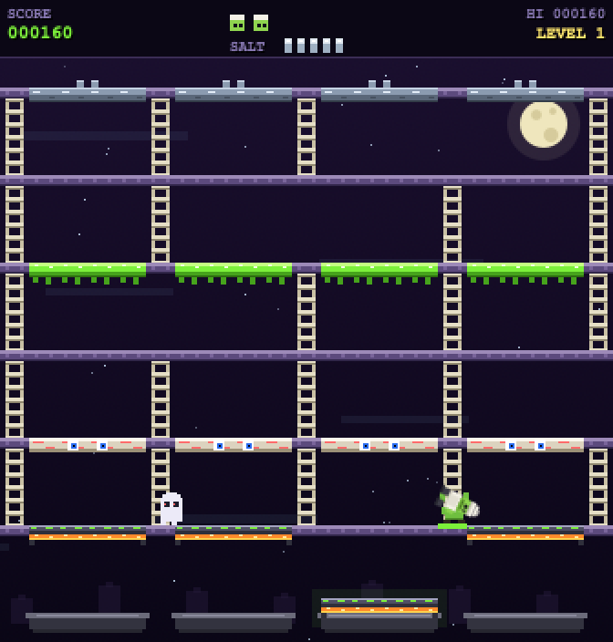

# GHOUL TIME — Slime Chef

A BurgerTime-style arcade game reskinned as a ghoul chef assembling slime recipes in a haunted
kitchen. Pure vanilla JS on a single `<canvas>` — no dependencies, no build step, one HTML file.

Deployed as a **Cloudflare Workers static-asset site**, so it is served from Cloudflare's global
edge network and costs nothing per request (static assets are not billed as Worker invocations).



## How to play

| Input | Action |
| --- | --- |
| Arrow keys / WASD | Move and climb ladders |
| Space / J | Throw grave salt (stuns ghouls ~4s) |
| P | Pause / resume |
| ← / → on the title | Flip to the high score tables |

Walk across all four segments of a recipe slab to knock it down. A falling slab lands on the slab
below and **cascades** — chaining layers together. Fill all four cauldrons to serve the slime and
clear the level.

**Recipe layers:** cauldron lid → eyeball layer → slime goo → ember-lit cauldron base.

**Scoring**
- 10 per slab segment stepped
- 50 per layer landing, 100 per cascade chain, 120 per layer plated
- Dropping a slab on enemies: 500 → 1000 → 2000 → 4000 (escalating per slab)
- Salting a ghoul: 200
- Candy-skull bonus: 500 + refills one salt charge
- Level clear: 1000 + 150 per unused salt charge

**Enemies:** Ghost, Goblin and Ghoul, each with different speeds and ladder-seeking AI. They get
faster and more numerous each level. Ride a falling slab to escape a corner.

Four ladder layouts rotate across levels. Your own best (the HUD's `HI`) persists via `localStorage`.

## High scores

Every game that scores can go on the world tables at
[scores.ipgoblin.com](https://scores.ipgoblin.com): one wiped every Monday, one all time, one line
per player. The tables are kept by the `scores-worker/` Worker; the repository README's
*High scores* section covers the service, its API and how scores are checked.

- **The title screen** alternates with the tables, arcade attract-loop style, and ← / → flip it.
- **At game over**, a form offers to sign your name onto the menu. It remembers the name, so after
  the first time posting is a single Enter; the first time it suggests a chef name to accept or type
  over. Esc skips.
- **After posting**, a panel shows where the game landed on both tables with your line lit up, even
  far below the top ten. Space plays again.

While the form has focus, the game leaves keys alone, so typing a name never moves the chef. Each
game asks the scoreboard for a run token when it starts; if the scoreboard cannot be reached the
game plays exactly as before and game over says so.

## Local development

```bash
npm install          # optional: only needed for the local wrangler devDependency
npm run dev          # serves at http://127.0.0.1:8787 via the real Workers runtime
```

The game is entirely contained in `public/index.html`, so you can also just open that file
directly in a browser — no server required. Opened that way it can show the tables but cannot post
to them, since the scoreboard only takes scores from the game's own site.

Served from `localhost` or `127.0.0.1`, the game talks to a local scores Worker on port 8789
instead of scores.ipgoblin.com: `npm run dev` in `../scores-worker`, after the first-time setup in
the repository README.

## Deploy

```bash
wrangler login       # once, if not already authenticated
npm run deploy
```

This publishes to `https://ghoul-time.<your-subdomain>.workers.dev`.

To use a custom domain, add a route in `wrangler.jsonc` (the zone must be on your Cloudflare
account):

```jsonc
"routes": [
  { "pattern": "ghoultime.example.com", "custom_domain": true }
]
```

## Project layout

```
ghoul-time/
├── public/
│   └── index.html    # the entire game (canonical source)
├── docs/
│   └── screenshot.png
├── wrangler.jsonc    # Workers static-assets config
└── package.json
```

`not_found_handling` is set to `single-page-application`, so any path serves the game rather than
returning a 404.
