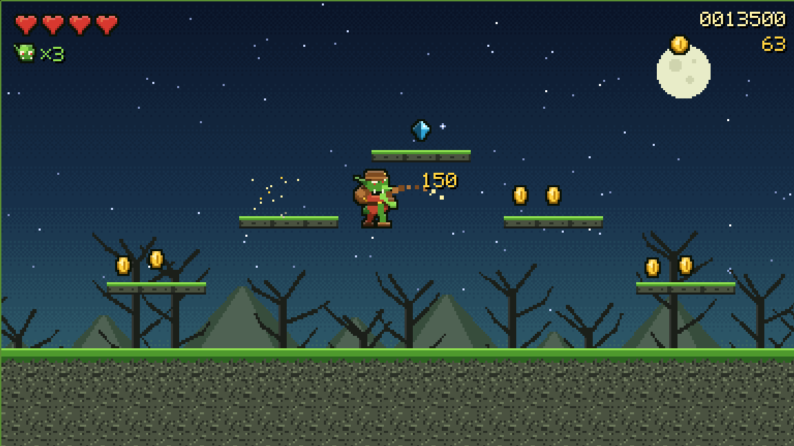

# GOBLIN HOARD

A 16-bit side-scrolling action platformer. You are a small, greedy goblin with a whip and a
sack. Four levels of the network stand between you and the hoard.

Vanilla JavaScript, no dependencies, no build step — and **no binary assets**: every sprite,
tile, backdrop, font glyph and note of music is generated in code at boot. The whole game is
about 100 KB of source.

Deployed as a **Cloudflare Workers static-asset site**, so it is served from Cloudflare's edge
and costs nothing per request (static assets are not billed as Worker invocations).

Live at **https://hoard.ipgoblin.com**.



## How to play

| Input | Action |
| --- | --- |
| Arrow keys / WASD | Move |
| Space / Z | Jump — press again in mid-air to flutter |
| X / J | Whip |
| P / Esc | Pause |
| M | Mute |

A gamepad works if one is plugged in, and touch controls appear on coarse-pointer devices.

The whip swings in an overhead arc, so it reaches things above you as well as in front. You can
also drop on an enemy's head. Chain kills within two and a half seconds to build a multiplier.

**Enemies**

| | Behaviour |
| --- | --- |
| Packet Slime | Hops along a ledge. Two hits. |
| Byte Bat | Hovers, then dives when you come within range. One hit. |
| Firewall Knight | **The shield blocks anything from the front.** Hit it from behind, or land on it. |
| Router Golem | Bolted down, spits packets when you are roughly level with it. |
| The Root Daemon | The level-four boss. It drifts and shoots, then slams the floor — the slam is your window. |

**Scoring** — 25 a coin, 250 a gem, 2500 a goblin idol (there is one hidden up high), 150–400 an
enemy times the chain multiplier, 5000 the boss, plus a clear bonus for leftover health and lives.
The high score is kept in `localStorage`.

## How it is built

| File | What it does |
| --- | --- |
| `js/pixl.js` | Pixel-art toolkit: a small colour grid with shapes, auto-outlining and rim shading, baked to canvases |
| `js/art.js` | Every character, pickup and prop, drawn procedurally |
| `js/tiles.js` | Tilesets and parallax backdrops, one theme per level |
| `js/font.js` | 5x7 bitmap font, baked to a tinted atlas per colour |
| `js/levels.js` | Level data — the hand-authored segments and the level list |
| `js/level.js` | Tilemap assembly, collision queries, drawing |
| `js/player.js` | The goblin |
| `js/entities.js` | Shared physics, enemies, pickups, projectiles, boss |
| `js/fx.js` | Particles, floating numbers, screen shake, hit-stop |
| `js/audio.js` | WebAudio chiptune engine and sound effects |
| `js/input.js` | Keyboard, gamepad and touch folded into one action model |
| `js/hud.js` | HUD and the full-screen states |
| `js/main.js` | Boot, game state machine, fixed-timestep loop |

### Why there are no image files

Sprites are drawn with code into a small `Grid` of colour strings, then baked once into canvases.
Two passes do most of the work: `rim()` lightens pixels with nothing above them and darkens those
with nothing below, and `outline()` grows a dark border into the surrounding transparency. That is
what makes everything look like it came from the same artist without hand-placing pixels.

It also means poses are maths rather than frames. The goblin's run cycle is one draw function
given hand and foot targets on an ellipse, so there are eight run frames for the price of one.

### Levels

Levels are assembled from hand-authored 24x18 character grids in `js/levels.js`. Every segment is
solid across its bottom three rows at both edges, so any two segments join and the seam is always
walkable.

The geometry is written against the movement, which is the part worth knowing before editing a
level: a running jump clears **4.4 tiles horizontally and 2.3 tiles vertically**, and those are not
additive — a jump that also climbs two tiles only carries about two tiles across. So ground gaps
stay at three tiles, and platforms that step up two tiles sit no more than two tiles apart. The
mid-air flutter roughly doubles the reach, but nothing in the game requires it.

Solid tiles are auto-tiled from a four-bit neighbour mask, so a level only ever says `#` and the
correct caps, edges and corners follow.

### Rendering

Everything is drawn into a 384x216 buffer and scaled up with `image-rendering: pixelated`. Above
2x the scale is a whole number so every pixel stays square; below that the canvas is allowed to
fill the screen, because rounding 1.9 down to 1 would waste half a phone display.

The loop is a fixed 60 Hz timestep with a capped accumulator, so physics never changes with the
refresh rate.

### Audio

`js/audio.js` is a small tracker: square, triangle and noise voices driven by a look-ahead
scheduler, with one track per level plus title, victory and defeat cues. Patterns are written as
note strings and **each channel loops at its own length**, so a miscounted bar shifts the groove
instead of breaking the track.

The AudioContext is only created on a real user gesture, which is what autoplay policy requires —
so there is no sound until you press something.

## Local development

```bash
npm install          # optional: only for the local wrangler devDependency
npm run dev          # http://127.0.0.1:8788 via the real Workers runtime
```

Or serve `public/` with anything — the game is ES modules, so it needs a server rather than
`file://`:

```bash
cd public && python3 -m http.server 8799
```

## Deploy

```bash
wrangler login       # once, if not already authenticated
npm run deploy
```

`wrangler.jsonc` declares `hoard.ipgoblin.com` as a custom domain, so `wrangler deploy` creates
and maintains the DNS record in the Cloudflare zone. `workers_dev` is off, so the custom domain is
the only way in. `not_found_handling` is `single-page-application`, so any path serves the game.
